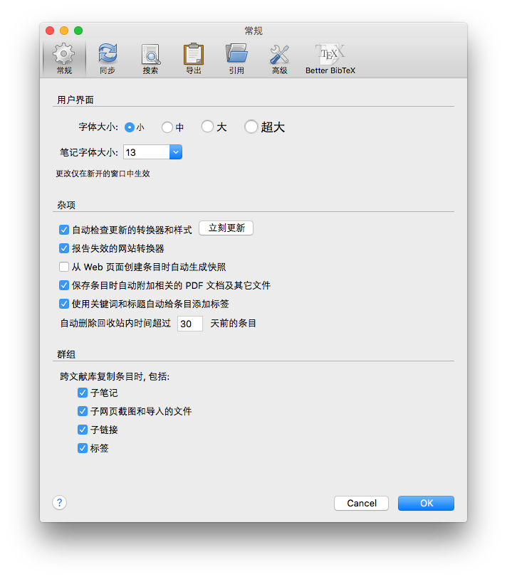
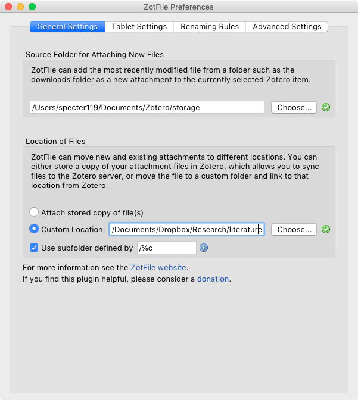

#实现Zotero条目和附件的独立同步

##条目同步
　　这里的条目同步指的就是文献信息的同步，这个通过zotero本身就能很容易实现，以下给出一些建议设置。  

1. 设置同步账户并取消内置文件同步  
　　注[册zotero账户](https://www.zotero.org/user/register/)(温馨提示，有google图片验证，需要科学上网)，在`首选项→同步→设置`中填写账号密码。  
　　zotero免费账户包含300mb同步空间，经测试，zoteo条目的存储并不记录在这300mb以内，但是仍显得太小，故应取消内置文件同步，在`首选项→同步→设置`中取消`文件同步`下面两个选项的勾选。
　　
2. 取消自动生成快照  
　　zotero默认设置为保存快照，网页快照包含了大量零碎的文件，估计同步起来也会有困难，对于一部分想保留的快照，依旧可以手动保存，所以建议取消自动生成快照。  
　　

##附件同步
　　附件同步的实现，需要安装zotfile，当然一个可靠的同步盘也是不可或缺的。在进行之前最好先明确两个概念：
> `数据存储位置`和`链接附件的根目录`:  
> 　　`数据存储位置`是zotero本地几乎所有的配置、文献数据库、附件存放的地方，可以说除了可执行文件和插件都在此处。一般来说，并不需要同步。该目录下的`storage`子目录，存放有本地所有的附件，我们需要将`storage`设置为zotfile的监听目录。  
> 　　`链接附件的根目录`是zotero保存文件链接的目录，当zotero以文件链接形式保存附件时，会记住在这目录下找相对路径。有些抽象，但是以后可能慢慢明白，记住只要同步这个文件夹就好了！

1. 配置附件链接根目录      
　　建议先修改`首选项`→`高级`→`文件和文件夹`中的`数据存储位置`。选择`自定义`，修改为自己顺手的位置，而后zotero会询问重启，并且大多数配置会丢掉，一般来说安好zotero先修改的是这个。  
　　重启后，重新修改配置，此时，设置`首选项`→`高级`→`文件和文件夹`中`链接附件的根目录`，这就是附件最终存放的位置，因此是同步盘能同步的位置。  
　　

2. 下载安装zofile  
　　任意浏览器点开[官方4.2.6版链接](https://addons.cdn.mozilla.net/user-media/addons/284723/zotfile-4.2.6-fx.xpi)，下载后在zotero中打开`工具→插件`，按右上角齿轮选择`Install Add-on Form File ...`，选中刚刚下载的`zotfile-4.2.6-fx.xpi`文件进行安装(Mac和Win版本可以拖拽，为了通用性，不再赘述)。
　　

3. 配置zotfie  
　　打开`ZotFile Preferences ...`，`General Settings`标签页，`Source Folder for Attaching new Files`设置为`数据存储位置`下的`storage`。`Location of Files`设置为`链接附件的根目录`。
　　

4. 同步&Enjoy!  
　　开启同步就好了，对于已经存在本地的附件，请选中所有条目，右键`Manage Attachments`→`Rename Attachments`。

##结语
　　至此，条目和附件的基本配置就已经结束了，如果需要对附件进行更好的组织或者在Zotflie的使用中出现了问题，请去网络上查找相关资料。